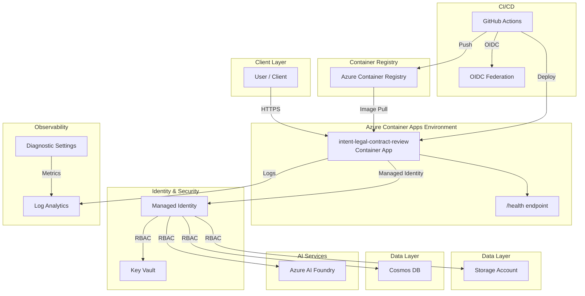

# Architecture Plan: intent-legal-contract-review

> Enterprise-grade api workload deployed on Azure Container Apps with managed identity, Key Vault secret management, Log Analytics observability, and private networking. CI/CD via GitHub Actions with OIDC authentication.

## Intent

```
# Intent: Legal Contract Review and Redlining AI

## Project Configuration

- **Project Name:** contract-review
- **App Type:** api
- **Data Stores:** blob, cosmos
- **Region:** eastus2
- **Environment:** dev
- **Auth:** entra-id
- **Compliance:** HIPAA, SOC2

---

## Problem Statement

St. Luke's Hospital Network's legal team manually reviews 200+ vendor contracts annually, spending 4-8 hours per contract analyzing clauses for compliance with healthcare regulations, institutional risk tolerance, and HIPAA requirements. This manual process creates bottlenecks in vendor onboarding, increases risk of missing critical protective clauses, and consumes $120K+ annually in legal staff time. Missed or weak clauses in vendor agreements have resulted in 3 incidents in the past 18 months requiring legal intervention and additional insurance claims.

**Affected Users:** 5 legal staff members, 12 procurement officers, 45+ department heads who engage vendors

**Cost of Inaction:** Continued 4-8 hour review cycles per contract, ongoing risk exposure from inadequate clause coverage, potential HIPAA violations from vendor agreements lacking proper data security provisions

---

## Business Goals

1. **Reduce contract review time by 75%** -- from 4-8 hours to under 60 minutes per contract
2. **Achieve 100% coverage** of required protective clauses across all vendor agreements
3. **Eliminate manual clause comparison** -- AI-driven comparison against standard clause library
4. **Reduce legal staff time cost by $90K+ annually** through automation
5. **Improve risk posture** -- zero missed HIPAA or liability clauses in vendor agreements
6. **Enable self-service redlining** for procurement officers with AI-generated suggestions

**Revenue/Cost Impact:** $90K annual savings in legal staff time, $50K reduction in potential liability exposure, 3x faster vendor onboarding cycle

---

## Target Users

### Primary: Legal Staff
- **Persona:** Sarah Chen, Senior Hospital Legal Counsel
- **Role:** Contract review and negotiation
- **Technical Proficiency:** Microsoft Office, DocuSign, contract management systems
- **Needs:** Fast clause identification, accurate risk scoring, actionable redline suggestions with legal justification

### Secondary: Procurement Officers
- **Persona:** Mark Rodriguez, Procurement Manager
- **Role:** Vendor onboarding and contract coordination
- **Technical Proficiency:** ERP systems, basic document management
- **Needs:** Upload contracts, view AI analysis results, forward to legal with pre-identified issues

### Tertiary: Department Heads
- **Persona:** Dr. Emily Washington, Department Chair
- **Role:** Budget authority for vendor agreements
- **Technical Proficiency:** Email, basic web apps
- **Needs:** Read-only access to contract risk summaries, approve/reject based on AI recommendations

---

## Functional Requirements

### F1: Document Upload and Processing
- Accept PDF and DOCX contract uploads via REST API (max 50MB)
- Extract text with layout preservation using Azure Document Intelligence
- Store original files in Azure Blob Storage with encryption at rest
- Generate structured document metadata (page count, sections, party names)

### F2: AI-Powered Clause Analysis
- Analyze extracted text using GPT-4-1 against healthcare-specific risk framework
- Identify and classify clauses across 6 categories:
  - Liability limitations
  - Indemnification
  - HIPAA compliance and BAA requirements
  - Data security and breach notification
  - Insurance requirements
  - Termination and renewal
- Score risk for each clause (Low/Medium/High/Critical)
- Compare found clauses against standard clause library (20+ standard clauses)

### F3: Redline Generation
- Generate specific redline suggestions for missing or weak clauses
- Provide protective alternative language for each suggestion
- Include legal justification and reference to institutional policy
- Export redlines to DOCX with track changes enabled

### F4: Contract Management API
- `POST /contracts/upload` -- Upload contract file
- `GET /contracts/{id}` -- Retrieve contract analysis results
- `GET /contracts/{id}/redlines` -- Get redline suggestions
- `POST /contracts/{id}/approve` -- Mark contract as approved
- `GET /contracts` -- List all contracts with filters (by risk, date, status)

### F5: Risk Dashboard
- Display risk summary by category with counts and severity
- Show clause comparison matrix (found vs. standard)
- Highlight missing required clauses
- Provide downloadable PDF risk report

---

## Scalability Requirements

- **Concurrent Users:** 25 simultaneous contract uploads
- **Peak Load:** 50 contracts/day during procurement sprint cycles
- **Document Size:** Support contracts up to 50MB, 200 pages
- **Response Time:** Document processing under 90 seconds for 50-page contract
- **Storage:** 5,000 contracts over 24 months (~50GB historical data)
- **API Rate:** 100 requests/minute sustained

---

## Security & Compliance

### Authentication & Authorization
- Microsoft Entra ID (Azure AD) integration for SSO
- Role-based access control (RBAC):
  - `Legal.Admin` -- full access, clause library management
  - `Legal.Reviewer` -- upload, analyze, redline
  - `Procurement.Officer` -- upload, view results (read-only redlines)
  - `Department.Head` -- view summaries only
- Managed Identity for all Azure service authentication

### Data Security
- Encryption at rest for all blob storage (AES-256)
- Encryption in transit (TLS 1.3)
- No PHI in contracts -- vendor agreements only
- Soft delete and purge protection for Key Vault secrets
- Diagnostic logs to Log Analytics for audit trail

### Compliance Frameworks
- **HIPAA:** Business Associate Agreement clause validation, breach notification requirements
- **SOC2:** Access controls, encryption, audit logging
- Data residency in US East region (no cross-border data transfer)

---

## Performance Requirements

- **Document Upload:** < 5 seconds for 10MB file
- **Text Extraction (Document Intelligence):** < 30 seconds for 50-page contract
- **AI Analysis (GPT-4-1):** < 45 seconds for full risk framework evaluation
- **End-to-End Processing:** < 90 seconds (upload → extract → analyze → redlines ready)
- **API p95 Latency:** < 2 seconds for GET requests, < 5 seconds for POST /upload
- **Availability SLA:** 99.9% uptime (43 minutes downtime/month allowed)
- **RTO:** 4 hours, **RPO:** 1 hour

---

## Integration Requirements

### Upstream Systems
- **Microsoft Entra ID** -- SSO authentication, user/group management
- **SharePoint/OneDrive** -- Future: direct contract import from document libraries
- **Email** -- Send analysis summaries via Microsoft Graph API

### Downstream Systems
- **Contract Management System (Icertis)** -- Future: push completed contracts with redlines applied
- **Legal Case Management** -- Export risk reports for litigation readiness review

### Event-Driven Triggers
- New contract uploaded → trigger Document Intelligence processing → trigger AI analysis
- High/Critical risk detected → send alert to `legal-team@stlukes.org`
- Contract approved → archive to long-term storage, update CRM

---

## Acceptance Criteria

### Functional Tests
- Upload 5 sample contracts (PDF/DOCX) -- all process successfully under 90 seconds
- Verify all 6 clause categories identified in test contracts
- Confirm redline suggestions generated for missing HIPAA BAA clause
- Validate RBAC -- Procurement.Officer cannot access clause library management

### Performance Benchmarks
- Load test: 25 concurrent uploads complete within 120 seconds
- Verify Document Intelligence extracts tables and multi-column layouts accurately
- Measure p95 latency < 2 seconds for GET /contracts

### Security Validation
- Confirm Managed Identity used for Blob, Cosmos DB, Document Intelligence
- Verify no secrets in environment variables or code
- Run container as non-root user
- Validate TLS 1.3 on all endpoints

### Compliance Checks
- HIPAA BAA clause detected with 100% accuracy in 10 test contracts
- Audit logs capture all document uploads with user identity and timestamp
- Data encrypted at rest and in transit (verified via Azure Policy)

---

*Generated for the GitHub Copilot SDK Enterprise Challenge, Q3 FY26*
*Target: St. Luke's Hospital Network -- Legal Operations Automation* Problem Statement: St. Luke's Hospital Network's legal team manually reviews 200+ vendor contracts annually, spending 4-8 hours per contract analyzing clauses for compliance with healthcare regulations, institutional risk tolerance, and HIPAA requirements. This manual process creates bottlenecks in vendor onboarding, increases risk of missing critical protective clauses, and consumes $120K+ annually in legal staff time. Missed or weak clauses in vendor agreements have resulted in 3 incidents in the past 18 months requiring legal intervention and additional insurance claims.

**Affected Users:** 5 legal staff members, 12 procurement officers, 45+ department heads who engage vendors

**Cost of Inaction:** Continued 4-8 hour review cycles per contract, ongoing risk exposure from inadequate clause coverage, potential HIPAA violations from vendor agreements lacking proper data security provisions

--- Business Goals: 1. **Reduce contract review time by 75%** -- from 4-8 hours to under 60 minutes per contract
2. **Achieve 100% coverage** of required protective clauses across all vendor agreements
3. **Eliminate manual clause comparison** -- AI-driven comparison against standard clause library
4. **Reduce legal staff time cost by $90K+ annually** through automation
5. **Improve risk posture** -- zero missed HIPAA or liability clauses in vendor agreements
6. **Enable self-service redlining** for procurement officers with AI-generated suggestions

**Revenue/Cost Impact:** $90K annual savings in legal staff time, $50K reduction in potential liability exposure, 3x faster vendor onboarding cycle

--- Scalability Requirements: - **Concurrent Users:** 25 simultaneous contract uploads
- **Peak Load:** 50 contracts/day during procurement sprint cycles
- **Document Size:** Support contracts up to 50MB, 200 pages
- **Response Time:** Document processing under 90 seconds for 50-page contract
- **Storage:** 5,000 contracts over 24 months (~50GB historical data)
- **API Rate:** 100 requests/minute sustained

--- Performance Requirements: - **Document Upload:** < 5 seconds for 10MB file
- **Text Extraction (Document Intelligence):** < 30 seconds for 50-page contract
- **AI Analysis (GPT-4-1):** < 45 seconds for full risk framework evaluation
- **End-to-End Processing:** < 90 seconds (upload → extract → analyze → redlines ready)
- **API p95 Latency:** < 2 seconds for GET requests, < 5 seconds for POST /upload
- **Availability SLA:** 99.9% uptime (43 minutes downtime/month allowed)
- **RTO:** 4 hours, **RPO:** 1 hour

---
```

## Executive Summary

Enterprise-grade api workload deployed on Azure Container Apps with managed identity, Key Vault secret management, Log Analytics observability, and private networking. CI/CD via GitHub Actions with OIDC authentication.

## Components

| Component | Azure Service | Purpose | Bicep Module |
|-----------|--------------|---------|-------------|
| container-app | Azure Container Apps | Hosts the api application with auto-scaling | `container-app.bicep` |
| key-vault | Azure Key Vault | Centralized secret and certificate management | `keyvault.bicep` |
| log-analytics | Azure Log Analytics | Centralized logging, monitoring, and diagnostics | `log-analytics.bicep` |
| managed-identity | Azure Managed Identity | Passwordless authentication between Azure resources | `managed-identity.bicep` |
| container-registry | Azure Container Registry | Private container image registry for application images | `container-registry.bicep` |
| storage-account | Azure Storage Account | Blob storage for documents and data | `storage.bicep` |
| cosmos-db | Azure Cosmos DB | NoSQL database for application data | `cosmos-db.bicep` |


## Architecture Diagram



## Architecture Decision Records


### ADR-001: Use Azure Container Apps for compute

- **Status:** Accepted
- **Context:** Need a managed container platform that supports auto-scaling, managed identity, and integrated logging without Kubernetes operational overhead.
- **Decision:** Selected Azure Container Apps over AKS and App Service. Container Apps provides Kubernetes-based scaling with a serverless operational model.
- **Consequences:** Simpler operations than AKS. Some limitations on advanced networking compared to AKS. Acceptable for this workload.

### ADR-002: Use Managed Identity for all service-to-service auth

- **Status:** Accepted
- **Context:** Enterprise security policy requires passwordless authentication. Credential rotation and secret sprawl are operational risks.
- **Decision:** All Azure resource access uses User-Assigned Managed Identity with least-privilege RBAC roles.
- **Consequences:** Eliminates credential management. Requires proper role assignments in Bicep. Slightly more complex initial setup.

### ADR-003: Use Bicep for Infrastructure as Code

- **Status:** Accepted
- **Context:** Need Azure-native IaC that supports ARM validation, what-if analysis, and integrates with az CLI.
- **Decision:** Selected Bicep over Terraform for Azure-native tooling, no state file management, and direct ARM integration.
- **Consequences:** Azure-only (acceptable for this scope). Native az deployment group validate support.

### ADR-004: Use Key Vault for all secrets

- **Status:** Accepted
- **Context:** No secrets should be stored in code, environment variables, or CI/CD configuration directly.
- **Decision:** All secrets stored in Azure Key Vault. Application accesses them via Managed Identity. CI/CD uses OIDC.
- **Consequences:** Additional Key Vault resource cost. Requires proper access policies. Eliminates secret exposure risk.

### ADR-005: Private ingress by default

- **Status:** Accepted
- **Context:** Enterprise workloads should not be publicly accessible unless explicitly required.
- **Decision:** Container Apps environment configured with internal ingress. External access requires explicit configuration.
- **Consequences:** Requires VNet integration for access. More secure by default. May need adjustment for public-facing APIs.

### ADR-006: Use Azure AI Foundry for AI/ML integration

- **Status:** Accepted
- **Context:** Workload requires AI capabilities. Need enterprise-grade AI platform with content safety and monitoring.
- **Decision:** Use Azure AI Foundry (formerly Azure AI Studio) for model hosting and inference, with content safety filters enabled.
- **Consequences:** Requires Azure AI Foundry resource provisioning. Content safety may filter edge cases. Provides audit trail.


## Assumptions

- Using Python + fastapi as application stack
- Azure Container Apps as compute target
- Managed Identity for authentication
- Key Vault for secret management
- Log Analytics for observability

## Open Risks

- Intent may require clarification for complex architectures

## Agent Confidence

**Confidence Level:** 75%

---
*Generated by Enterprise DevEx Orchestrator Agent*
