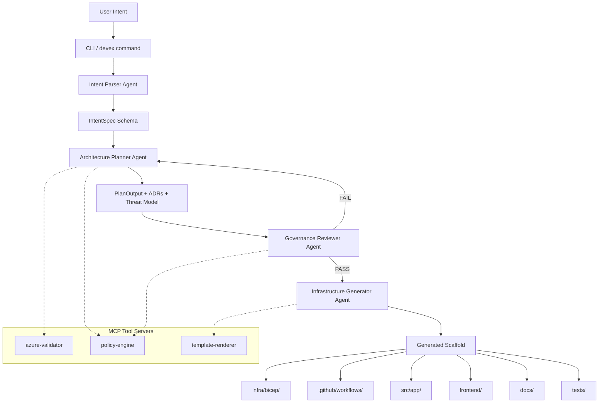
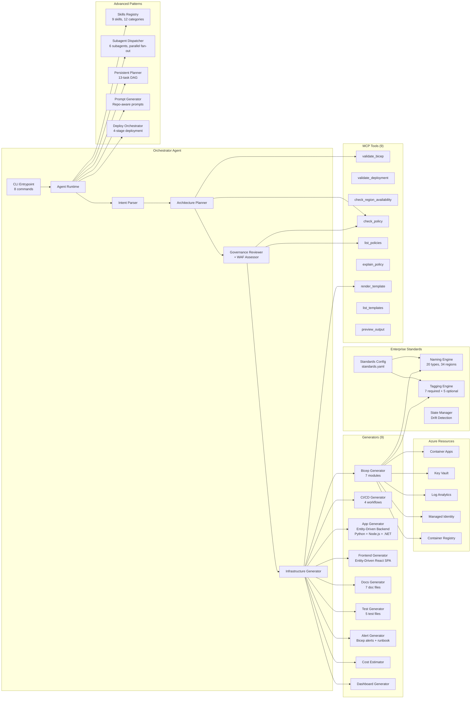
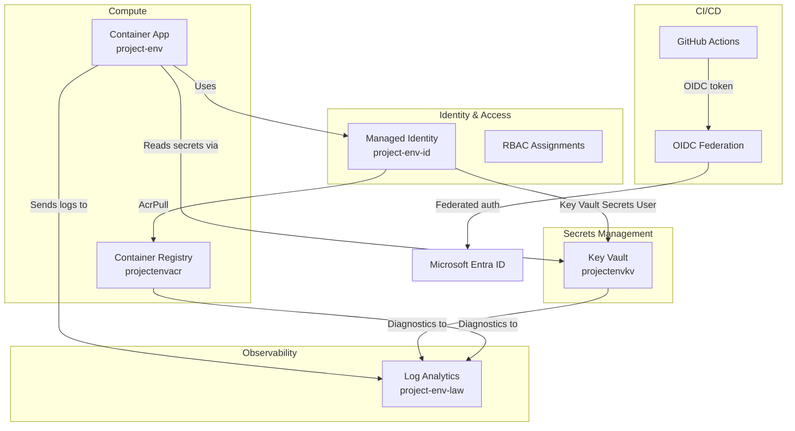
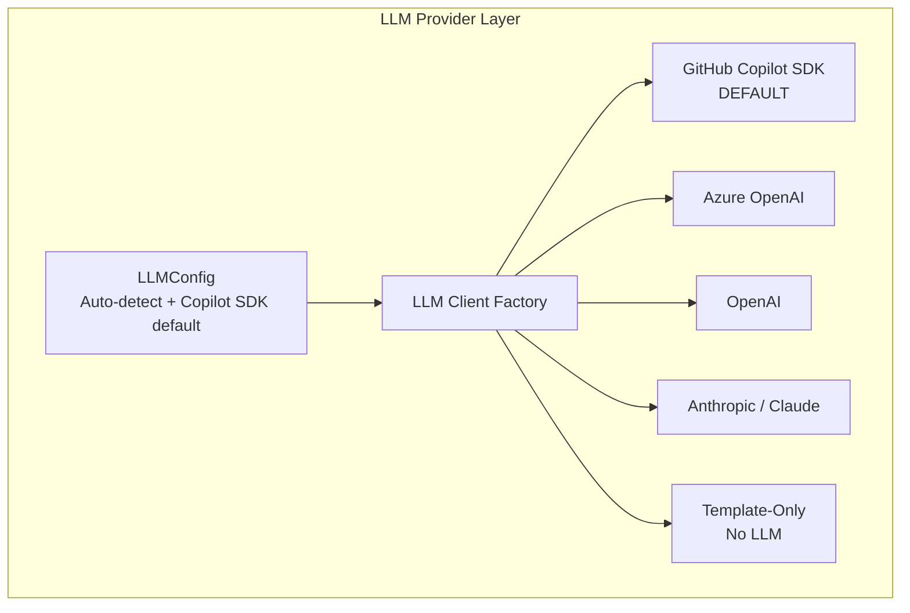

# Architecture Overview

> **Enterprise DevEx Orchestrator** -- 4-Agent Chain Architecture
> Transforms business intent into production-ready Azure workloads

---

## High-Level Flow

## Component Architecture

## Data Flow

| Stage | Input | Processing | Output |
|-------|-------|-----------|--------|
| 1. Parse | Plain-text intent or `intent.md` | LLM extraction + 5-phase semantic entity extraction + rule-based fallback | `IntentSpec` (Pydantic) with `DomainType`, semantically-extracted entities, endpoints |
| 2. Plan | `IntentSpec` | Component selection, 6 ADRs, STRIDE threat model, Mermaid diagram | `PlanOutput` |
| 3. Review | `IntentSpec` + `PlanOutput` | 25-policy validation, WAF 5-pillar assessment (26 principles) | `GovernanceReport` + `WAFAlignmentReport` |
| 4. Generate | All above | 9 generators produce Bicep, workflows, app, frontend, docs, tests, alerts, cost, dashboard | `dict[str, str]` file map |
| 5. Record | Generated files | SHA-256 manifest, drift detection, audit trail | `.devex/state.json` |
| 6. Deploy | Output directory | 4-stage: validate -> what-if -> deploy -> verify | Deployment result |

## Security Architecture

## Design Principles

| # | Principle | Implementation |
|---|-----------|---------------|
| 1 | Deterministic Structure | File layout, naming, and module organization are always the same |
| 2 | Controlled Variability | LLM adds context-specific content within deterministic boundaries |
| 3 | Governance by Default | Every scaffold passes 25-policy governance validation before output |
| 4 | Defense in Depth | Identity, encryption, networking, scanning -- multiple security layers |
| 5 | Observable from Day 1 | Log Analytics + diagnostics configured for all resources |
| 6 | Enterprise Standards | Azure CAF naming (20 types) + tagging (12 tags) enforced via YAML |
| 7 | State Awareness | Every generation tracked with drift detection between runs |
| 8 | WAF Aligned | 26/26 Azure Well-Architected Framework principles covered |

## Agent Capabilities Summary

| Agent | Tools | LLM Provider | Fallback | Key Output |
|-------|-------|-------------|----------|-----------|
| Intent Parser | None (pure LLM) | GitHub Copilot SDK (default) | 5-phase semantic extraction engine + domain detection | `IntentSpec` with `DomainType`, entities, endpoints |
| Architecture Planner | `check_policy`, `check_region_availability` | GitHub Copilot SDK (default) | Template-based component builder | `PlanOutput` with ADRs + threat model |
| Governance Reviewer | `check_policy`, `list_policies`, `validate_bicep` | GitHub Copilot SDK (default) | Policy catalog evaluation | `GovernanceReport` + `WAFAlignmentReport` |
| Infrastructure Generator | `render_template`, `preview_output`, `validate_bicep` | GitHub Copilot SDK (default) | Direct file generation | Complete file tree (backend + frontend + infra) |

## LLM Provider Architecture

The orchestrator supports multiple LLM backends with **GitHub Copilot SDK as the default**:

| Provider | Default Model | Auto-Detect Env Var | Priority |
|----------|--------------|---------------------|----------|
| Azure OpenAI | `gpt-4o` | `AZURE_OPENAI_ENDPOINT` | 1 (highest) |
| Anthropic | `claude-opus-4-20250514` | `ANTHROPIC_API_KEY` | 2 |
| OpenAI | `gpt-4o` | `OPENAI_API_KEY` | 3 |
| GitHub Copilot SDK | `gpt-4o` | `GITHUB_TOKEN` | 4 |
| GitHub Copilot SDK | `gpt-4o` | (none — default fallback) | 5 (always) |

**Key modules:** `config.py` (LLMConfig, auto-detection), `llm_client.py` (provider adapters), `agent.py` (AgentRuntime integration).

---

*4-agent chain | 9 MCP tools | 9 generators | 25 policies | 543 tests*
*Multi-provider LLM: GitHub Copilot SDK (default) · Azure OpenAI · OpenAI · Anthropic (Claude)*
*Azure CAF naming + enterprise tagging + WAF 5-pillar alignment*
*Domain-agnostic semantic extraction: Any business domain*
*Backend: Python (FastAPI) · Node.js (Express) · .NET (ASP.NET Core)*
*Frontend: Entity-Driven React 18 + Vite 5 + TypeScript SPA*

