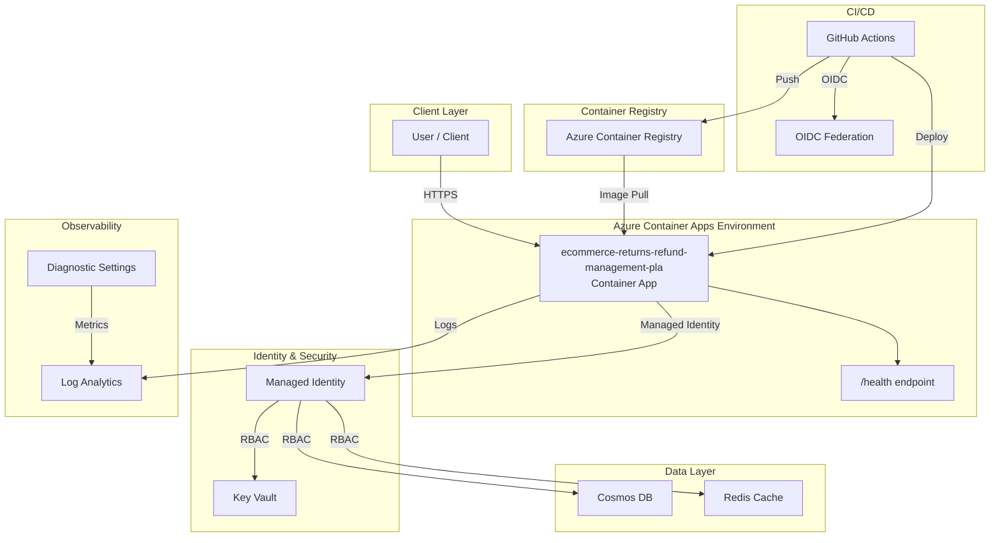

# Architecture Plan: ecommerce-returns-refund-management-pla

> Enterprise-grade api workload deployed on Azure Container Apps with managed identity, Key Vault secret management, Log Analytics observability, and private networking. CI/CD via GitHub Actions with OIDC authentication.

## Intent

```
Build an enterprise-grade ecommerce returns and refund management API that automates the full lifecycle of product returns, refund processing, and customer communication for a mid-to-large online retailer handling 50,000+ orders per month. Problem Statement: Our ecommerce business is losing $2.3M annually due to manual return processing, inconsistent refund timelines, and poor visibility into return reasons. Customer support agents spend 40% of their time on return-related inquiries. We need an automated system that tracks returns from initiation through resolution, enforces return policies automatically, and provides real-time analytics on return patterns to reduce return rates. Business Goals: - Reduce average return processing time from 14 days to 3 days
- Cut customer support tickets related to returns by 60%
- Achieve 99.5% refund accuracy (eliminate over-refunds and under-refunds)
- Provide real-time return analytics dashboard for operations team
- Reduce annual return-related losses by 40% within 6 months Target Users: - **Customers**: Initiate returns, track refund status, print return labels
- **Customer Support Agents**: Review escalated returns, override policies, manage disputes
- **Operations Managers**: Monitor return trends, configure policies, view analytics
- **Finance Team**: Reconcile refunds, audit refund transactions, generate reports Functional Requirements: - Return Request API: customers submit returns with order ID, item, reason, and photos
- Automated eligibility check against configurable return policies (time window, item condition, category exclusions)
- Return status tracking: initiated, label_generated, in_transit, received, inspected, approved, refund_issued, completed, rejected
- Refund calculation engine: original payment method, store credit, partial refunds, restocking fees
- Return label generation and shipment tracking integration
- Policy management: configurable rules per product category, customer tier, and return reason
- Analytics endpoints: return rate by category, top return reasons, average processing time, refund amounts
- Webhook notifications for status changes
- Bulk return processing for operations team Scalability Requirements: - 50,000 orders/month, 15% return rate (~7,500 returns/month)
- Peak: 3x during holiday season (22,500 returns/month)
- API: 100 RPS sustained, 500 RPS peak
- Data retention: 3 years for compliance Security & Compliance: - Auth: managed-identity for service-to-service, Entra ID for user authentication
- PCI DSS compliance for refund transaction data
- GDPR: customer data anonymization on request
- Role-based access: customer, support_agent, ops_manager, finance
- Audit trail on all refund transactions Performance Requirements: - p50 latency: 80ms, p95: 200ms, p99: 500ms
- Return eligibility check: < 50ms
- Refund processing: < 2 seconds
- Dashboard queries: < 1 second
- SLA: 99.9% uptime
- RTO: 1 hour, RPO: 5 minutes Integration Requirements: - Payment gateway integration for refund processing (Stripe, PayPal)
- Shipping carrier APIs for return label generation (UPS, FedEx, USPS)
- Order management system for order validation
- Inventory system for restocking workflows
- Email/SMS notification service for customer updates
- ERP system for financial reconciliation Acceptance Criteria: - All return lifecycle endpoints return correct HTTP status codes
- Policy engine correctly evaluates eligibility for 10+ rule combinations
- Refund calculations match expected amounts within $0.01 precision
- Dashboard API returns aggregated analytics in under 1 second
- Health endpoint returns 200 with service dependencies status
- All endpoints enforce authentication and RBAC
- Audit log captures every refund transaction with actor, amount, and timestamp Application type: api. Data stores: cosmos, redis. Azure region: eastus2. Environment: dev. Authentication: managed-identity. Compliance framework: SOC2, PCI.
```

## Executive Summary

Enterprise-grade api workload deployed on Azure Container Apps with managed identity, Key Vault secret management, Log Analytics observability, and private networking. CI/CD via GitHub Actions with OIDC authentication.

## Components

| Component | Azure Service | Purpose | Bicep Module |
|-----------|--------------|---------|-------------|
| container-app | Azure Container Apps | Hosts the api application with auto-scaling | `container-app.bicep` |
| key-vault | Azure Key Vault | Centralized secret and certificate management | `keyvault.bicep` |
| log-analytics | Azure Log Analytics | Centralized logging, monitoring, and diagnostics | `log-analytics.bicep` |
| managed-identity | Azure Managed Identity | Passwordless authentication between Azure resources | `managed-identity.bicep` |
| container-registry | Azure Container Registry | Private container image registry for application images | `container-registry.bicep` |
| cosmos-db | Azure Cosmos DB | NoSQL database for application data | `cosmos-db.bicep` |
| redis-cache | Azure Redis Cache | In-memory cache for low-latency data access and session management | `redis.bicep` |


## Architecture Diagram



## Architecture Decision Records


### ADR-001: Use Azure Container Apps for compute

- **Status:** Accepted
- **Context:** Need a managed container platform that supports auto-scaling, managed identity, and integrated logging without Kubernetes operational overhead.
- **Decision:** Selected Azure Container Apps over AKS and App Service. Container Apps provides Kubernetes-based scaling with a serverless operational model.
- **Consequences:** Simpler operations than AKS. Some limitations on advanced networking compared to AKS. Acceptable for this workload.

### ADR-002: Use Managed Identity for all service-to-service auth

- **Status:** Accepted
- **Context:** Enterprise security policy requires passwordless authentication. Credential rotation and secret sprawl are operational risks.
- **Decision:** All Azure resource access uses User-Assigned Managed Identity with least-privilege RBAC roles.
- **Consequences:** Eliminates credential management. Requires proper role assignments in Bicep. Slightly more complex initial setup.

### ADR-003: Use Bicep for Infrastructure as Code

- **Status:** Accepted
- **Context:** Need Azure-native IaC that supports ARM validation, what-if analysis, and integrates with az CLI.
- **Decision:** Selected Bicep over Terraform for Azure-native tooling, no state file management, and direct ARM integration.
- **Consequences:** Azure-only (acceptable for this scope). Native az deployment group validate support.

### ADR-004: Use Key Vault for all secrets

- **Status:** Accepted
- **Context:** No secrets should be stored in code, environment variables, or CI/CD configuration directly.
- **Decision:** All secrets stored in Azure Key Vault. Application accesses them via Managed Identity. CI/CD uses OIDC.
- **Consequences:** Additional Key Vault resource cost. Requires proper access policies. Eliminates secret exposure risk.

### ADR-005: Private ingress by default

- **Status:** Accepted
- **Context:** Enterprise workloads should not be publicly accessible unless explicitly required.
- **Decision:** Container Apps environment configured with internal ingress. External access requires explicit configuration.
- **Consequences:** Requires VNet integration for access. More secure by default. May need adjustment for public-facing APIs.


## Assumptions

- Using Python + fastapi as application stack
- Azure Container Apps as compute target
- Managed Identity for authentication
- Key Vault for secret management
- Log Analytics for observability

## Open Risks

- Intent may require clarification for complex architectures

## Agent Confidence

**Confidence Level:** 75%

---
*Generated by Enterprise DevEx Orchestrator Agent*
