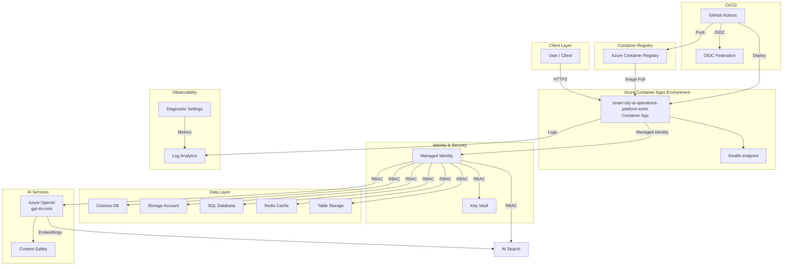

# Architecture Plan: smart-city-ai-operations-platform-extre

> Enterprise-grade ai_app workload deployed on Azure Container Apps with managed identity, Key Vault secret management, Log Analytics observability, and private networking. CI/CD via GitHub Actions with OIDC authentication.

## Intent

```
Build an enterprise-grade AI-powered smart city operations platform that orchestrates **9 distinct domain entities** across every supported data store (Cosmos DB, SQL, Blob Storage, Redis, AI Search, Table Storage), uses Azure OpenAI for multi-agent AI workflows, RAG-grounded chat, content safety filtering, and predictive analytics. The platform manages the full lifecycle of emergency incidents, infrastructure assets, environmental sensors, citizen service requests, transit routes, utility grids, city zones, fleet vehicles, and AI audit logs — each with unique field types, status workflows, and action endpoints. A GPT-4o command center copilot enables natural-language queries over all 9 entities, and Semantic Kernel agents autonomously triage incidents, predict failures, detect environmental violations, and route citizen requests. The system must handle 250,000+ concurrent IoT sensor streams, 500+ operator sessions, and 10,000 citizen interactions/day with FedRAMP, SOC2, and HIPAA compliance, WAF-protected public endpoints, and full AI audit logging. File upload processing supports incident photos (GPT-4o Vision), audio recordings (Whisper transcription), and scanned document extraction.

--- Problem Statement: City operations are fragmented across 14 disconnected legacy systems impacting 2.1 million residents and 85,000 city employees. Emergency response times average 12 minutes due to manual dispatch — an AI agent could triage and dispatch in under 30 seconds. Utility outages go undetected for hours because 250,000+ sensor alerts are siloed across 12 vendor protocols — an LLM-powered anomaly correlation engine could detect cascading failures in real time. Citizens file 40% duplicate service requests across 3 separate portals — a chatbot with RAG grounding over 500,000+ city knowledge articles could resolve 60% instantly. Environmental compliance violations have increased 23% YoY with $4.2M in EPA fines — an autonomous agent could continuously monitor 50 pollutant thresholds and auto-generate regulatory reports. Transit delays cost $180M annually in lost productivity — AI-optimized route prediction using historical ridership embeddings could reduce delays 35%. Fleet maintenance consumes $22M/year with 30% being reactive emergency repairs — predictive maintenance could shift 85% to scheduled preventive work. The city has no unified asset registry — 47,000 infrastructure assets are tracked in spreadsheets across 6 departments. No audit trail exists for AI interactions despite processing sensitive PII, medical data, and law enforcement information. The city loses $6M annually from uncoordinated operations that AI-driven cross-domain correlation could eliminate.

--- Business Goals: - Deploy a multi-agent AI system with 6 specialized Semantic Kernel agents orchestrated via tool-calling with agent-to-agent delegation
- Reduce emergency dispatch triage from 12 minutes to under 30 seconds using GPT-4o incident classification with Vision for photo evidence analysis
- Implement RAG-grounded citizen copilot resolving 60% of inquiries from 500,000+ knowledge articles via hybrid vector + BM25 search
- Achieve 99.99% uptime SLA for the AI command center serving 500+ concurrent operators with natural-language cross-domain queries
- Process 10,000 citizen requests daily with AI classification (>95% accuracy), semantic duplicate detection (>85% precision), and automated routing
- Save $5M annually through AI-predicted maintenance using embeddings similarity search against 100,000+ historical failure signatures
- Reduce environmental violations by 80% through autonomous LLM-powered threshold monitoring with auto-generated EPA reports and RAG-cited regulatory references
- Optimize 200+ transit routes using ridership prediction embeddings, reducing delays by 35% and saving $63M annually
- Track 47,000 infrastructure assets with AI-generated health scores, GPS coordinates, and full maintenance history
- Manage a fleet of 1,200 city vehicles with real-time GPS tracking, fuel analytics, and AI-predicted maintenance scheduling
- Maintain full AI audit trail with every prompt, completion, token count, latency, and content safety result logged for 7-year retention
- Achieve FedRAMP Moderate, SOC2 Type II, and HIPAA compliance across all AI data pipelines

--- Target Users: 1. **City Operations Commander** — Senior C-suite using the AI copilot to query cross-domain city status in natural language. Interacts through chat grounded by RAG over all operational data. Needs unified dashboard showing all 9 entity types with KPI tiles.

2. **Emergency Dispatch Coordinator** — First responder staff receiving AI-generated triage recommendations. The DispatchAgent auto-classifies incidents from text+photo, recommends nearest units, generates GPS routes. Human approves or overrides.

3. **Utility Grid Engineer** — Engineers receiving AI failure predictions. The MaintenanceAgent analyzes vibration/temperature/load via embeddings similarity to historical failures and generates preventive work orders.

4. **Environmental Compliance Officer** — Regulatory staff using the EnvironmentAgent for continuous threshold monitoring, LLM-classified violation severity, and auto-generated compliance reports with RAG-cited EPA regulations.

5. **Citizen Services Agent** — Call center staff augmented by the CitizenAgent chatbot. Citizens interact via natural-language chat, AI searches knowledge base, creates service requests, and detects duplicates via semantic similarity.

6. **Transit Operations Manager** — Transit managers querying AI for route optimization, ridership predictions, delay forecasting, and incident impact analysis via natural-language queries.

7. **Fleet Manager** — Fleet supervisors tracking 1,200 vehicles with GPS, managing fuel budgets, scheduling maintenance, and receiving AI-predicted failure alerts for aging vehicles.

8. **Zone Administrator** — District managers overseeing specific city zones with aggregated dashboards of all incidents, assets, sensors, and citizen requests within their geographic boundary.

9. **City Data Analyst** — Analysts using AI copilot for natural-language analytics ("What was the average response time for fire incidents in Q3?") translated to KQL by the AnalyticsAgent.

10. **AI Safety Reviewer** — Security staff monitoring content safety dashboards, reviewing flagged AI interactions, tuning content filtering policies, and auditing AI decision logs.

11. **Maintenance Planner** — Planners reviewing AI-generated work orders, scheduling maintenance windows, and tracking asset lifecycle costs across all infrastructure categories.

--- Scalability Requirements: - 50,000 concurrent WebSocket connections for real-time command center
- 250,000 IoT sensor streams with p99 < 500ms ingestion latency
- GPT-4o inference: 500 concurrent chat sessions with p95 < 3 seconds
- AI Search: 1,000 queries/second across 500,000+ documents
- 10,000 citizen interactions/day with burst capacity 2,000/hour
- 500+ concurrent operator sessions
- Token budget: 2M tokens/hour across all 6 AI agents
- 100TB+ blob storage for sensor data, media, photos, audio, and audit logs
- 5TB Cosmos DB at 50,000 RU/s for hot telemetry and AI sessions
- Redis 50GB for buffering, sessions, and AI response caching
- SQL database for relational asset registry, work orders, citizen cases, and fleet records
- Table Storage for high-volume audit log archival (billions of entries)
- Auto-scale 4 to 40 container instances based on sensor + AI load

--- Security & Compliance: - Entra ID with Conditional Access for all operator and AI interactions
- RBAC with 11 roles: Commander, Dispatcher, GridEngineer, ComplianceOfficer, CitizenServiceAgent, TransitManager, FleetManager, ZoneAdmin, DataAnalyst, MaintenancePlanner, AISafetyReviewer
- Azure OpenAI via Managed Identity with Cognitive Services OpenAI User role — zero API keys
- AI Search via Managed Identity with Search Index Data Contributor + Search Service Contributor
- Content safety filtering on public AI endpoints with custom blocklists
- Prompt injection detection on every inbound AI request
- AI audit logging with 7-year retention
- FedRAMP Moderate with AI data residency (US regions only)
- SOC2 Type II with AI-specific controls
- HIPAA guidance for medical emergency data
- Encryption at rest (AES-256) and in transit (TLS 1.3)
- Key Vault with HSM-backed keys
- Private endpoints for all Azure services
- WAF on citizen-facing AI endpoints
- Network segmentation: IoT DMZ, AI private subnet, management plane

--- Performance Requirements: - AI chat: p50 < 1s, p95 < 3s, p99 < 5s (RAG + LLM)
- RAG retrieval: p50 < 100ms, p95 < 300ms
- Agent tool-calling: < 2s per invocation
- Sensor ingestion: p50 < 100ms, p95 < 250ms, p99 < 500ms
- API (non-AI): p50 < 50ms, p95 < 200ms, p99 < 500ms
- AI incident triage: < 30 seconds end-to-end
- Content safety: < 200ms additional latency
- File upload analysis: < 10s for photos (Vision), < 30s for audio (Whisper)
- Cross-domain correlation: < 5s for multi-entity AI query
- SLA: 99.99%, RTO: 5 min, RPO: 30 sec

--- Acceptance Criteria: 1. **9 Entity CRUD**: All 9 entities (Incident, Asset, Sensor, ServiceRequest, TransitRoute, Vehicle, Zone, WorkOrder, AuditLog) have full CRUD endpoints with proper schemas, validation, and seed data
2. **Action Endpoints**: All 35+ domain action endpoints (triage, dispatch, escalate, predict, calibrate, optimize, deploy, evacuate, approve, etc.) are generated and routable
3. **AI Agents**: 6 Semantic Kernel agents deployed with tool-calling and agent-to-agent delegation
4. **RAG Pipeline**: AI Search index with hybrid search, verified retrieval with >0.75 relevance
5. **Content Safety**: 100% of injection attempts blocked, all flagged interactions audit-logged
6. **Dashboard**: Interactive dashboard shows all 9 entity types with KPI tiles, status badges, and entity-specific metrics  
7. **File Upload**: Photo analysis (Vision), audio transcription (Whisper), and document extraction working
8. **Cross-Domain Query**: AI chat handles queries spanning multiple entity types simultaneously
9. **Security**: Zero API keys, Managed Identity everywhere, WAF enabled, RBAC with 11 roles
10. **Data Stores**: All 6 data stores (Cosmos, SQL, Blob, Redis, AI Search, Table) properly configured with Bicep modules
11. **Governance**: 24/24 policy checks pass, WAF alignment >95% across all 5 pillars
12. **Performance**: API p95 < 200ms, AI chat p95 < 3s, sensor ingestion p99 < 500ms under load Application type: ai_app. Data stores: cosmos, blob, sql, redis, ai_search, table. Azure region: eastus2. Environment: prod. Authentication: entra-id. Compliance framework: SOC2, HIPAA, FedRAMP.
```

## Executive Summary

Enterprise-grade ai_app workload deployed on Azure Container Apps with managed identity, Key Vault secret management, Log Analytics observability, and private networking. CI/CD via GitHub Actions with OIDC authentication.

## Components

| Component | Azure Service | Purpose | Bicep Module |
|-----------|--------------|---------|-------------|
| container-app | Azure Container Apps | Hosts the ai_app application with auto-scaling | `container-app.bicep` |
| key-vault | Azure Key Vault | Centralized secret and certificate management | `keyvault.bicep` |
| log-analytics | Azure Log Analytics | Centralized logging, monitoring, and diagnostics | `log-analytics.bicep` |
| managed-identity | Azure Managed Identity | Passwordless authentication between Azure resources | `managed-identity.bicep` |
| container-registry | Azure Container Registry | Private container image registry for application images | `container-registry.bicep` |
| cosmos-db | Azure Cosmos DB | NoSQL database for application data | `cosmos-db.bicep` |
| storage-account | Azure Storage Account | Blob storage for documents and data | `storage.bicep` |
| sql-database | Azure SQL Database | Relational database for structured application data | `sql.bicep` |
| redis-cache | Azure Redis Cache | In-memory cache for low-latency data access and session management | `redis.bicep` |
| ai-search | Azure AI Search | Vector and semantic search for RAG patterns and knowledge retrieval | `ai-search.bicep` |
| table-storage | Azure Table Storage | NoSQL key-value storage for structured data | `table-storage.bicep` |
| azure-openai | Azure OpenAI Service | LLM inference for chat, embeddings, and AI agent capabilities | `openai.bicep` |


## Architecture Diagram



## Architecture Decision Records


### ADR-001: Use Azure Container Apps for compute

- **Status:** Accepted
- **Context:** Need a managed container platform that supports auto-scaling, managed identity, and integrated logging without Kubernetes operational overhead.
- **Decision:** Selected Azure Container Apps over AKS and App Service. Container Apps provides Kubernetes-based scaling with a serverless operational model.
- **Consequences:** Simpler operations than AKS. Some limitations on advanced networking compared to AKS. Acceptable for this workload.

### ADR-002: Use Managed Identity for all service-to-service auth

- **Status:** Accepted
- **Context:** Enterprise security policy requires passwordless authentication. Credential rotation and secret sprawl are operational risks.
- **Decision:** All Azure resource access uses User-Assigned Managed Identity with least-privilege RBAC roles.
- **Consequences:** Eliminates credential management. Requires proper role assignments in Bicep. Slightly more complex initial setup.

### ADR-003: Use Bicep for Infrastructure as Code

- **Status:** Accepted
- **Context:** Need Azure-native IaC that supports ARM validation, what-if analysis, and integrates with az CLI.
- **Decision:** Selected Bicep over Terraform for Azure-native tooling, no state file management, and direct ARM integration.
- **Consequences:** Azure-only (acceptable for this scope). Native az deployment group validate support.

### ADR-004: Use Key Vault for all secrets

- **Status:** Accepted
- **Context:** No secrets should be stored in code, environment variables, or CI/CD configuration directly.
- **Decision:** All secrets stored in Azure Key Vault. Application accesses them via Managed Identity. CI/CD uses OIDC.
- **Consequences:** Additional Key Vault resource cost. Requires proper access policies. Eliminates secret exposure risk.

### ADR-005: Private ingress by default

- **Status:** Accepted
- **Context:** Enterprise workloads should not be publicly accessible unless explicitly required.
- **Decision:** Container Apps environment configured with internal ingress. External access requires explicit configuration.
- **Consequences:** Requires VNet integration for access. More secure by default. May need adjustment for public-facing APIs.

### ADR-006: Use Azure OpenAI + AI Foundry for AI workloads

- **Status:** Accepted
- **Context:** Workload requires AI/LLM capabilities. Need enterprise-grade AI platform with content safety, model management, and audit trail.
- **Decision:** Deploy Azure OpenAI for model inference with content safety filters. Use AI Foundry for model management, prompt engineering, and evaluation. All access via Managed Identity with RBAC.
- **Consequences:** Requires Azure OpenAI resource and model deployment. Content safety filters may block edge cases. Provides full audit trail and responsible AI controls.

### ADR-007: Use Azure AI Search for RAG grounding

- **Status:** Accepted
- **Context:** RAG pattern requires vector search for document grounding to reduce hallucination.
- **Decision:** Deploy Azure AI Search with vector index for semantic retrieval. Documents are embedded via Azure OpenAI embeddings model and indexed for similarity search.
- **Consequences:** Additional search index cost. Requires document ingestion pipeline. Significantly improves answer accuracy and reduces hallucination.

### ADR-008: Use Semantic Kernel for agent orchestration

- **Status:** Accepted
- **Context:** Agentic workload requires tool-use, planning, and multi-step reasoning.
- **Decision:** Use Semantic Kernel SDK for agent orchestration with Azure OpenAI. Agents can invoke tools, plan multi-step actions, and maintain conversation state.
- **Consequences:** Adds Semantic Kernel dependency. Enables flexible agent patterns with tool-calling and function invocation.


## Assumptions

- Using Python + fastapi as application stack
- Azure Container Apps as compute target
- Managed Identity for authentication
- Key Vault for secret management
- Log Analytics for observability

## Open Risks

- Intent may require clarification for complex architectures

## Agent Confidence

**Confidence Level:** 75%

---
*Generated by Enterprise DevEx Orchestrator Agent*
