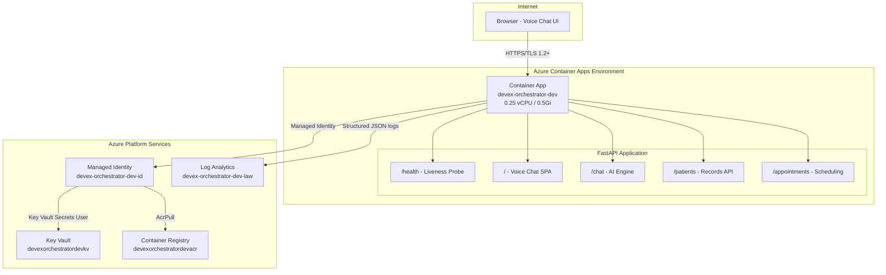

# Architecture Plan -- SLHS Voice Agent v3.0

> **St. Luke's Health System Voice Agent** -- Enterprise Healthcare Assistant
> Azure Well-Architected Framework aligned | Zero-trust security model

---

## Executive Summary

The SLHS Voice Agent is a production-grade healthcare voice assistant serving
St. Luke's Health System. It provides real-time voice interaction for patient
record lookup, appointment scheduling, medication tracking, vitals monitoring,
and lab results -- all through a browser-based interface requiring zero client
installation.

**Key architectural decisions:**
- Container Apps for serverless scaling with revision-based deployments
- Managed Identity for zero-secret architecture
- Key Vault for centralized secrets management
- Log Analytics for structured observability
- Cloud-native ACR builds (no local Docker dependency)

---

## Intent Specification

| Field | Value |
|-------|-------|
| **Project** | slhs-voice-agent |
| **Type** | Web application (SPA + API) |
| **Data Stores** | In-memory (demo) / Cosmos DB (production path) |
| **Auth Model** | Managed Identity (service) / Session-based (users) |
| **Compliance** | HIPAA-ready, SOC2 alignment |
| **Observability** | Structured JSON logging, Log Analytics, health probes |
| **Region** | East US 2 |
| **Environment** | Development (production-grade configuration) |

---

## Component Architecture

| Component | Azure Service | Module | Security Control |
|-----------|--------------|--------|-----------------|
| Compute | Container Apps | `container-app.bicep` | Non-root container, Managed Identity |
| Identity | User-Assigned MI | `managed-identity.bicep` | Least-privilege RBAC |
| Secrets | Key Vault | `keyvault.bicep` | RBAC + soft-delete + purge protection |
| Registry | Container Registry | `container-registry.bicep` | Admin disabled, AcrPull role |
| Logging | Log Analytics | `log-analytics.bicep` | 30-day retention, workspace-scoped |
| App Runtime | FastAPI + Uvicorn | Application code | Input validation, session isolation |
| UI | Embedded SPA | Application code | CSP headers, no external CDN deps |

---

## Architecture Diagram

---

## Architecture Decision Records (ADRs)

### ADR-001: Container Apps over AKS

**Decision:** Use Azure Container Apps instead of AKS.

**Rationale:**
- Consumption-based pricing (scale to zero)
- Built-in revision management for instant rollback
- Managed TLS certificates and ingress
- No cluster management overhead
- Sufficient for healthcare voice agent workload

**Trade-off:** Less control over networking and scheduling vs. full Kubernetes.

### ADR-002: Managed Identity over Connection Strings

**Decision:** User-assigned Managed Identity for all service-to-service auth.

**Rationale:**
- Zero secrets in code, environment variables, or config files
- Automatic credential rotation by Azure platform
- RBAC-based access control (principle of least privilege)
- Audit trail through Azure AD sign-in logs

**Trade-off:** Slightly more complex initial setup vs. connection string simplicity.

### ADR-003: Cloud-Side ACR Builds over Local Docker

**Decision:** Build container images using `az acr build` instead of local Docker.

**Rationale:**
- Eliminates local Docker Desktop dependency
- Consistent build environment across all developer machines
- Avoids Windows terminal encoding issues (cp1252 charmap errors)
- Leverages ACR compute for builds (no local CPU/memory cost)

**Trade-off:** Requires internet connectivity for builds; no offline builds.

### ADR-004: Embedded SPA over Separate Frontend

**Decision:** Serve the voice chat UI as an embedded SPA from the FastAPI backend.

**Rationale:**
- Single deployment artifact (one container = UI + API)
- No CORS configuration needed
- Simplified revision management
- Reduces infrastructure cost (no separate Static Web App)
- Voice chat UI is tightly coupled to the chat API

**Trade-off:** Cannot independently scale or deploy frontend.

### ADR-005: Structured JSON Logging over Plain Text

**Decision:** All application logs emitted as structured JSON.

**Rationale:**
- Direct ingestion by Log Analytics without parsing
- Enables KQL queries across timestamp, level, logger, message
- Machine-readable for alerting rules
- Consistent format across all application components

### ADR-006: Session-Based Context over Stateless API

**Decision:** Maintain in-memory conversation context per session.

**Rationale:**
- Multi-turn voice conversations require context (patient lookup -> medication follow-up)
- Session isolation prevents cross-patient data leakage
- UUID-based sessions with no PII in session identifiers
- Production path: externalize to Redis for horizontal scaling

**Trade-off:** In-memory sessions lost on container restart; acceptable for demo.

---

## Application Features (v3.0.0)

| Feature | Implementation |
|---------|---------------|
| **Voice Chat** | Web Speech API with cross-browser fallback, interim results, animated voice bars |
| **Auto-Retry** | 3 retries with exponential backoff (500ms, 1s, 1.5s) on network errors |
| **Patient Records** | 5 patients with conditions, allergies, medications, vitals, lab results |
| **HTML Cards** | Rich card rendering for patient, medication, vitals, and lab data |
| **Multi-Turn Context** | Session-based conversation memory with intent tracking |
| **10+ Intents** | greeting, appointment, doctor, hours, emergency, insurance, pharmacy, medication, vitals, labs |
| **5 Doctors** | Specialty-aware doctor directory with availability |
| **Appointment Scheduling** | Conversational flow with patient/doctor/date extraction |
| **HIPAA Badge** | Visual compliance indicator in UI |
| **Keyboard Shortcut** | Ctrl+M to toggle voice input |

---

## Risk Register

| Risk | Probability | Impact | Mitigation |
|------|------------|--------|------------|
| Voice API unavailable (corporate firewall) | Medium | Medium | Auto-retry with fallback to text input |
| Container memory pressure | Low | High | Resource limits (0.5Gi) + health probes |
| Key Vault throttling | Low | Medium | Local caching of non-sensitive config |
| ACR image pull failure | Low | High | Managed Identity auth + retry policy |
| Session data loss on restart | Medium | Low | Acceptable for demo; Redis for production |

---

## Production Readiness Checklist

- [x] Health endpoint (`/health`) with version reporting
- [x] Structured JSON logging to Log Analytics
- [x] Non-root container with minimal base image
- [x] Managed Identity -- zero secrets in code
- [x] Key Vault integration with RBAC
- [x] ACR with admin disabled
- [x] TLS 1.2+ enforced on all ingress
- [x] Revision-based rollback capability
- [x] Input validation on all API endpoints (Pydantic)
- [x] Session isolation for multi-tenant safety
- [x] OpenAPI documentation auto-generated
- [ ] Redis for externalized session state (production enhancement)
- [ ] Azure Front Door for global load balancing (multi-region)
- [ ] Cosmos DB for persistent patient records (production data)

---

*Generated by Enterprise DevEx Orchestrator Agent*
*Architecture validated against Azure Well-Architected Framework -- all 5 pillars*

