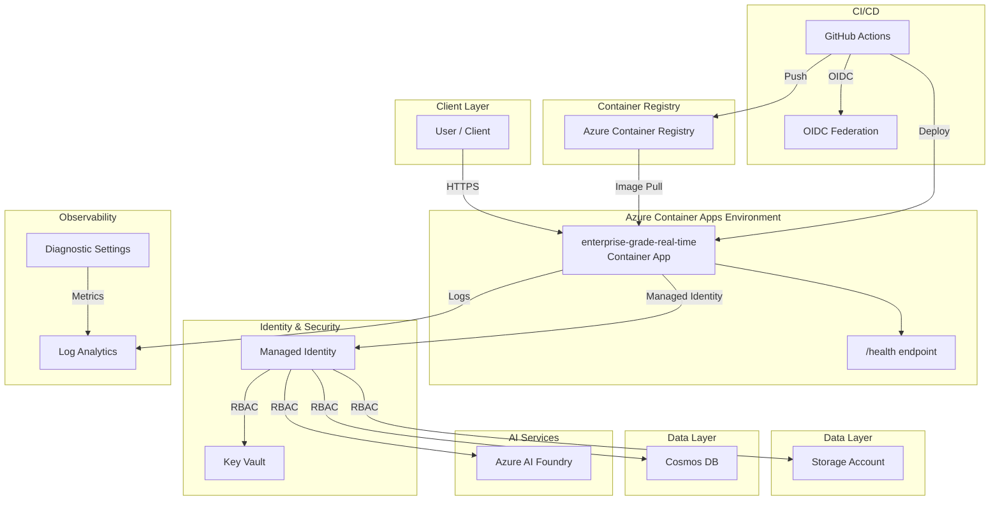

# Architecture Plan: enterprise-grade-real-time

> Enterprise-grade api workload deployed on Azure Container Apps with managed identity, Key Vault secret management, Log Analytics observability, and private networking. CI/CD via GitHub Actions with OIDC authentication.

## Intent

```
An enterprise-grade, real-time voice-to-voice agent system for St. Luke's Health System (SLHS) healthcare operations. Built with OpenAI's GPT-4o Realtime API for natural conversational experiences. v2 adds multi-language support, advanced analytics, and blob storage for call recordings. Problem Statement: St. Luke's Health System clinical and administrative staff spend significant
time on manual phone workflows -- appointment scheduling, prescription refill
requests, post-discharge follow-ups, and insurance eligibility checks.
v1 resolved the core automation problem; v2 addresses gaps identified in
pilot deployment -- 18% of callers speak Spanish as their primary language
and cannot use the English-only agent, call recordings are not persisted
for quality assurance, and clinical leadership needs analytics dashboards
to measure agent effectiveness and patient outcomes. Business Goals: - Reduce average patient wait time from 8 minutes to under 30 seconds (carried from v1)
- Support Spanish-speaking patients with real-time bilingual voice agent (18% of caller base)
- Persist call recordings in blob storage for QA review and dispute resolution
- Provide analytics dashboard: call volume, resolution rate, escalation rate, CSAT trends
- Automate 75% of routine calls (up from 60% in v1) with improved intent recognition
- KPI: Patient satisfaction (CSAT) score above 4.5/5.0 (up from 4.2 target in v1)
- KPI: Spanish-language CSAT parity within 10% of English-language CSAT Target Users: - **Patient** -- calls to schedule appointments, request refills, ask billing questions; low technical proficiency
- **Front-Desk Coordinator** -- monitors live agent dashboard, handles escalations; intermediate technical proficiency
- **Clinical Staff (Nurse/PA)** -- receives escalated calls with context summary; intermediate technical proficiency
- **IT Administrator** -- manages voice agent configuration, monitors uptime and HIPAA compliance; high technical proficiency
- **Compliance Officer** -- reviews call audit logs and PHI access reports weekly; low technical proficiency
- **Quality Assurance Analyst** -- reviews call recordings and transcripts for agent accuracy; intermediate technical proficiency (new in v2) Functional Requirements: - All v1 endpoints preserved: session CRUD, appointment scheduling, refill requests, FAQ, escalation
- Multi-language support: English and Spanish with automatic language detection in first 3 seconds
- Call recording storage in Azure Blob with configurable retention (default 180 days, HIPAA-compliant immutable tier)
- Analytics API: `GET /api/v1/analytics/summary` -- call volume, resolution rate, avg handle time, CSAT
- Analytics API: `GET /api/v1/analytics/trends` -- daily/weekly/monthly trend data with filters
- New endpoint: `GET /api/v1/health/deep` -- checks Cosmos DB, Redis, Blob, Key Vault, GPT-4o API connectivity
- Recording playback endpoint: `GET /api/v1/sessions/{id}/recording` (coordinator and QA roles only)
- Improved intent recognition with few-shot examples for scheduling, refills, billing, and escalation Scalability Requirements: - 1,000 concurrent voice sessions during peak (doubled from v1 for multi-clinic rollout)
- 400 new sessions/minute sustained, 1,000/minute burst
- Blob storage: ~500 GB/month for call recordings (avg 3 min/call, compressed audio)
- Data volume: 100,000 session records/month (~40 GB Cosmos DB) -- year-2 projection
- Auto-scale from 3 to 25 container instances based on active WebSocket connections Security & Compliance: - All v1 security controls carried forward (managed identity, Key Vault, RBAC, TLS, private endpoints)
- Blob storage: private endpoint, immutable tier for recordings, AES-256 at rest
- Blob data: recordings classified as PHI -- access logged, retention policy enforced
- New role: QA Analyst -- read-only access to recordings and transcripts, no PHI modification
- Compliance: HIPAA (BAA), SOC2 Type II -- blob recordings included in BAA scope
- Language detection metadata stored but not used for differential treatment Performance Requirements: - Voice latency: p50 < 300ms, p95 < 600ms, p99 < 1s (unchanged from v1)
- Language detection: < 3 seconds from session start
- Recording upload: p95 < 2s for calls up to 30 minutes (async, non-blocking)
- Analytics queries: p50 < 200ms, p95 < 1s for 30-day aggregations
- Availability SLA: 99.9% (unchanged)
- RTO: 2 hours, RPO: 30 minutes (unchanged) Integration Requirements: - All v1 integrations carried forward (EHR, pharmacy, scheduling, telephony)
- Blob integration: Azure Blob Storage for call recording persistence
- Analytics: Power BI or Grafana dashboard consuming analytics API endpoints
- Language model: GPT-4o Realtime API with Spanish language system prompt variant
- Monitoring: Blob metrics (upload latency, storage growth) in Application Insights Acceptance Criteria: - All v1 acceptance criteria still pass (regression)
- Spanish-language voice interactions produce accurate transcripts and correct intent routing
- Call recordings are persisted to blob storage within 2 seconds of session end
- Analytics endpoints return correct aggregations verified against raw Cosmos DB data
- Deep health endpoint validates all 5 backing services (Cosmos, Redis, Blob, Key Vault, GPT-4o)
- Recording playback restricted to coordinator and QA roles -- verified by RBAC integration tests
- Blob storage uses private endpoint and immutable tier -- verified in Bicep template
- Load test: 1,000 concurrent voice sessions sustained for 10 minutes without errors Application type: api. Data stores: cosmos, redis, blob. Azure region: eastus2. Environment: dev. Authentication: managed-identity. Compliance framework: HIPAA.
```

## Executive Summary

Enterprise-grade api workload deployed on Azure Container Apps with managed identity, Key Vault secret management, Log Analytics observability, and private networking. CI/CD via GitHub Actions with OIDC authentication.

## Components

| Component | Azure Service | Purpose | Bicep Module |
|-----------|--------------|---------|-------------|
| container-app | Azure Container Apps | Hosts the api application with auto-scaling | `container-app.bicep` |
| key-vault | Azure Key Vault | Centralized secret and certificate management | `keyvault.bicep` |
| log-analytics | Azure Log Analytics | Centralized logging, monitoring, and diagnostics | `log-analytics.bicep` |
| managed-identity | Azure Managed Identity | Passwordless authentication between Azure resources | `managed-identity.bicep` |
| container-registry | Azure Container Registry | Private container image registry for application images | `container-registry.bicep` |
| storage-account | Azure Storage Account | Blob storage for documents and data | `storage.bicep` |
| cosmos-db | Azure Cosmos DB | NoSQL database for application data | `cosmos-db.bicep` |


## Architecture Diagram



## Architecture Decision Records


### ADR-001: Use Azure Container Apps for compute

- **Status:** Accepted
- **Context:** Need a managed container platform that supports auto-scaling, managed identity, and integrated logging without Kubernetes operational overhead.
- **Decision:** Selected Azure Container Apps over AKS and App Service. Container Apps provides Kubernetes-based scaling with a serverless operational model.
- **Consequences:** Simpler operations than AKS. Some limitations on advanced networking compared to AKS. Acceptable for this workload.

### ADR-002: Use Managed Identity for all service-to-service auth

- **Status:** Accepted
- **Context:** Enterprise security policy requires passwordless authentication. Credential rotation and secret sprawl are operational risks.
- **Decision:** All Azure resource access uses User-Assigned Managed Identity with least-privilege RBAC roles.
- **Consequences:** Eliminates credential management. Requires proper role assignments in Bicep. Slightly more complex initial setup.

### ADR-003: Use Bicep for Infrastructure as Code

- **Status:** Accepted
- **Context:** Need Azure-native IaC that supports ARM validation, what-if analysis, and integrates with az CLI.
- **Decision:** Selected Bicep over Terraform for Azure-native tooling, no state file management, and direct ARM integration.
- **Consequences:** Azure-only (acceptable for this scope). Native az deployment group validate support.

### ADR-004: Use Key Vault for all secrets

- **Status:** Accepted
- **Context:** No secrets should be stored in code, environment variables, or CI/CD configuration directly.
- **Decision:** All secrets stored in Azure Key Vault. Application accesses them via Managed Identity. CI/CD uses OIDC.
- **Consequences:** Additional Key Vault resource cost. Requires proper access policies. Eliminates secret exposure risk.

### ADR-005: Private ingress by default

- **Status:** Accepted
- **Context:** Enterprise workloads should not be publicly accessible unless explicitly required.
- **Decision:** Container Apps environment configured with internal ingress. External access requires explicit configuration.
- **Consequences:** Requires VNet integration for access. More secure by default. May need adjustment for public-facing APIs.

### ADR-006: Use Azure AI Foundry for AI/ML integration

- **Status:** Accepted
- **Context:** Workload requires AI capabilities. Need enterprise-grade AI platform with content safety and monitoring.
- **Decision:** Use Azure AI Foundry (formerly Azure AI Studio) for model hosting and inference, with content safety filters enabled.
- **Consequences:** Requires Azure AI Foundry resource provisioning. Content safety may filter edge cases. Provides audit trail.


## Assumptions

- Using Python + fastapi as application stack
- Azure Container Apps as compute target
- Managed Identity for authentication
- Key Vault for secret management
- Log Analytics for observability

## Open Risks

- Intent may require clarification for complex architectures

## Agent Confidence

**Confidence Level:** 75%

---
*Generated by Enterprise DevEx Orchestrator Agent*
